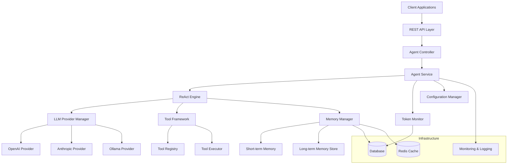
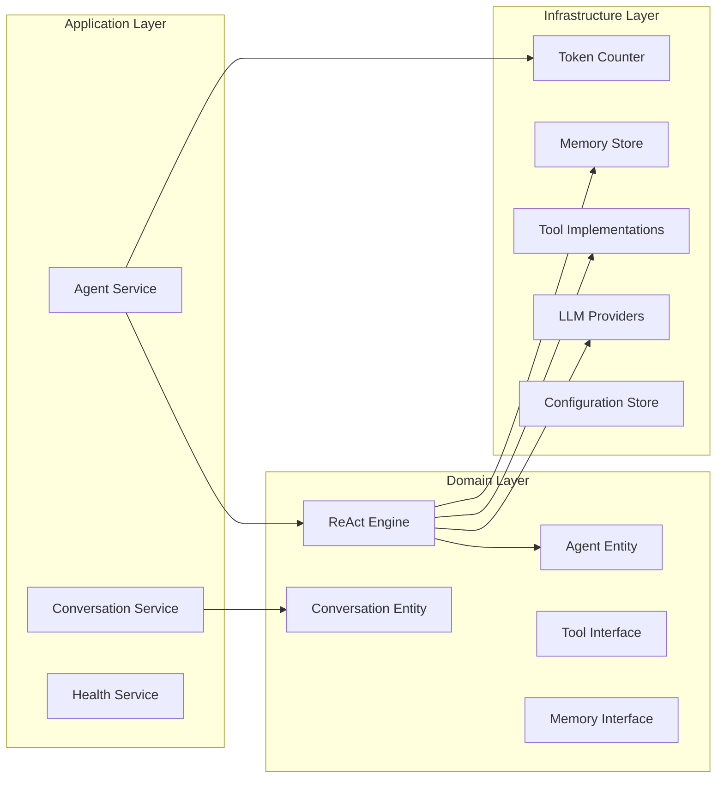

# Agent Application Design

## Overview

The Agent Application is a Java Spring Boot system that implements the ReAct (Reasoning and Acting) pattern for intelligent conversational agents. The architecture follows clean architecture principles with clear separation of concerns, enabling flexible LLM provider integration, dynamic tool management, and scalable conversation handling.

The system is designed as a cloud-native application with horizontal scaling capabilities, comprehensive observability, and robust security measures. It provides a REST API for client interactions while maintaining conversation state and managing resource consumption.

## Architecture

### High-Level Architecture



### Layered Architecture

The system follows a layered architecture pattern:

1. **Presentation Layer**: REST API controllers and request/response handling
2. **Application Layer**: Business logic orchestration and use case implementation
3. **Domain Layer**: Core business entities and domain logic (ReAct engine, agents)
4. **Infrastructure Layer**: External integrations, persistence, and technical concerns

### Component Architecture



## Components and Interfaces

### Core Components

#### 1. ReAct Engine
**Purpose**: Implements the Reasoning and Acting pattern for agent decision-making.

**Key Responsibilities**:
- Execute reasoning loops (Thought → Action → Observation)
- Manage conversation flow and context
- Coordinate between LLM providers and tools
- Handle error recovery and alternative strategies

**Interface**:
```java
public interface ReActEngine {
    AgentResponse processMessage(String conversationId, String message, AgentContext context);
    void continueReasoning(String conversationId, ToolResult toolResult);
    ConversationState getConversationState(String conversationId);
}
```

#### 2. LLM Provider Manager
**Purpose**: Abstracts LLM provider interactions and manages provider selection.

**Key Responsibilities**:
- Route requests to appropriate LLM providers
- Handle provider-specific authentication and configuration
- Implement retry logic and failover mechanisms
- Normalize responses across different providers

**Interface**:
```java
public interface LLMProviderManager {
    LLMResponse generateResponse(LLMRequest request, String providerId);
    List<String> getAvailableProviders();
    ProviderHealth checkProviderHealth(String providerId);
}
```

#### 3. Tool Framework
**Purpose**: Manages tool registration, discovery, and execution.

**Key Responsibilities**:
- Dynamic tool registration and discovery
- Parameter validation and type conversion
- Synchronous and asynchronous tool execution
- Error handling and result processing

**Interface**:
```java
public interface ToolFramework {
    void registerTool(Tool tool);
    ToolResult executeTool(String toolName, Map<String, Object> parameters);
    List<ToolDefinition> getAvailableTools();
    CompletableFuture<ToolResult> executeToolAsync(String toolName, Map<String, Object> parameters);
}
```

#### 4. Memory Manager
**Purpose**: Handles conversation context and persistent knowledge storage.

**Key Responsibilities**:
- Manage short-term conversation memory
- Store and retrieve long-term knowledge
- Implement memory optimization and cleanup
- Provide semantic search capabilities

**Interface**:
```java
public interface MemoryManager {
    void storeConversationContext(String conversationId, ConversationContext context);
    ConversationContext retrieveConversationContext(String conversationId);
    void storeLongTermMemory(String key, Object value, MemoryMetadata metadata);
    Optional<Object> retrieveLongTermMemory(String key);
    void cleanupExpiredMemory();
}
```

#### 5. Token Monitor
**Purpose**: Tracks and manages token consumption across conversations.

**Key Responsibilities**:
- Real-time token counting for requests and responses
- Enforce token limits and budgets
- Generate usage analytics and reports
- Implement cost optimization strategies

**Interface**:
```java
public interface TokenMonitor {
    TokenUsage trackTokenUsage(String conversationId, int inputTokens, int outputTokens);
    boolean checkTokenLimit(String conversationId, int estimatedTokens);
    TokenBudget getTokenBudget(String userId);
    UsageReport generateUsageReport(String userId, DateRange dateRange);
}
```

### Supporting Components

#### Configuration Manager
Handles environment-specific configuration, runtime updates, and secrets management.

#### Health Monitor
Provides system health checks, dependency monitoring, and status reporting.

#### Security Manager
Implements authentication, authorization, input validation, and audit logging.

## Data Models

### Core Entities

#### Agent
```java
public class Agent {
    private String id;
    private String name;
    private String description;
    private AgentConfiguration configuration;
    private List<String> availableTools;
    private MemoryConfiguration memoryConfig;
    private TokenLimits tokenLimits;
}
```

#### Conversation
```java
public class Conversation {
    private String id;
    private String agentId;
    private String userId;
    private ConversationState state;
    private List<Message> messages;
    private ConversationContext context;
    private TokenUsage tokenUsage;
    private Instant createdAt;
    private Instant lastActivity;
}
```

#### Message
```java
public class Message {
    private String id;
    private String conversationId;
    private MessageType type; // USER, ASSISTANT, SYSTEM, TOOL_CALL, TOOL_RESULT
    private String content;
    private Map<String, Object> metadata;
    private Instant timestamp;
}
```

#### Tool Definition
```java
public class ToolDefinition {
    private String name;
    private String description;
    private Map<String, ParameterDefinition> parameters;
    private boolean isAsync;
    private List<String> requiredPermissions;
}
```

#### ReAct State
```java
public class ReActState {
    private String conversationId;
    private ReActPhase currentPhase; // THINKING, ACTING, OBSERVING
    private String currentThought;
    private ToolCall pendingAction;
    private List<ToolResult> observations;
    private int iterationCount;
}
```

### Configuration Models

#### LLM Provider Configuration
```java
public class LLMProviderConfig {
    private String providerId;
    private String apiKey;
    private String baseUrl;
    private Map<String, String> headers;
    private RetryConfig retryConfig;
    private RateLimitConfig rateLimitConfig;
}
```

#### Tool Configuration
```java
public class ToolConfig {
    private String toolName;
    private String implementationClass;
    private Map<String, Object> configuration;
    private List<String> requiredPermissions;
    private boolean enabled;
}
```

## Error Handling

### Error Categories

1. **LLM Provider Errors**: Network failures, API rate limits, authentication issues
2. **Tool Execution Errors**: Parameter validation, execution failures, timeout errors
3. **Memory Errors**: Storage failures, retrieval errors, capacity limits
4. **Token Limit Errors**: Budget exceeded, rate limits, quota exhaustion
5. **Configuration Errors**: Invalid settings, missing credentials, dependency failures

### Error Handling Strategies

#### Circuit Breaker Pattern
Implement circuit breakers for external dependencies (LLM providers, databases) to prevent cascading failures.

#### Retry Mechanisms
- Exponential backoff for transient failures
- Provider failover for LLM requests
- Tool execution retry with different parameters

#### Graceful Degradation
- Continue operation with reduced functionality when non-critical components fail
- Fallback to cached responses when possible
- Provide meaningful error messages to users

#### Error Recovery
- Automatic conversation state recovery
- Memory consistency checks and repair
- Token usage reconciliation

### Exception Hierarchy
```java
public abstract class AgentException extends RuntimeException
public class LLMProviderException extends AgentException
public class ToolExecutionException extends AgentException
public class MemoryException extends AgentException
public class TokenLimitException extends AgentException
public class ConfigurationException extends AgentException
```

## Testing Strategy

### Unit Testing
- **Coverage Target**: 90% code coverage for core business logic
- **Focus Areas**: ReAct engine logic, tool framework, memory management
- **Mocking Strategy**: Mock external dependencies (LLM providers, databases)
- **Test Framework**: JUnit 5 with Mockito for mocking

### Integration Testing
- **API Testing**: Test REST endpoints with real HTTP requests
- **Database Testing**: Test persistence layer with embedded databases
- **Provider Testing**: Test LLM provider integrations with mock servers
- **Tool Testing**: Test tool execution with real implementations

### Contract Testing
- **LLM Provider Contracts**: Verify provider API compatibility
- **Tool Interface Contracts**: Ensure tool implementations meet interface requirements
- **API Contracts**: Validate REST API responses match OpenAPI specifications

### Performance Testing
- **Load Testing**: Simulate concurrent conversations and measure response times
- **Stress Testing**: Test system behavior under extreme load conditions
- **Token Usage Testing**: Verify token counting accuracy and limit enforcement
- **Memory Testing**: Test memory usage patterns and cleanup effectiveness

### Security Testing
- **Authentication Testing**: Verify JWT, API key, and OAuth2 implementations
- **Authorization Testing**: Test role-based access control
- **Input Validation Testing**: Test SQL injection, XSS, and other attack vectors
- **Rate Limiting Testing**: Verify rate limiting effectiveness

### End-to-End Testing
- **Conversation Flow Testing**: Test complete conversation scenarios
- **Multi-Agent Testing**: Test concurrent agent interactions
- **Failure Recovery Testing**: Test system recovery from various failure scenarios
- **Configuration Testing**: Test runtime configuration changes

### Test Data Management
- **Test Fixtures**: Standardized test data for consistent testing
- **Data Anonymization**: Ensure test data doesn't contain sensitive information
- **Test Environment**: Isolated test environment with mock external services
- **Cleanup Strategy**: Automatic cleanup of test data after test execution

### Continuous Testing
- **CI/CD Integration**: Automated testing in build pipeline
- **Test Reporting**: Comprehensive test reports with coverage metrics
- **Quality Gates**: Prevent deployment if tests fail or coverage drops
- **Performance Monitoring**: Track test execution time and identify slow tests